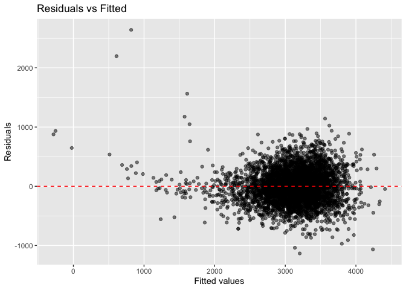
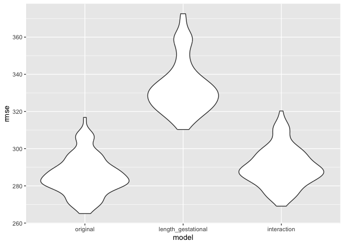

p8105_hw6
================
Tara Zhan_fz2377
2023-11-28

# Problem 1

# Problem 2

``` r
# Loading dataset: "weather_df"
weather_df = 
  rnoaa::meteo_pull_monitors(
    c("USW00094728"),
    var = c("prcp", "tmin", "tmax"), 
    date_min = "2022-01-01",
    date_max = "2022-12-31") |>
  mutate(
    name = recode(id, USW00094728 = "CentralPark_NY"),
    tmin = tmin / 10,
    tmax = tmax / 10) |>
  select(name, id, everything())
```

This weather data for Central Park, New York, for the year 2022,
focusing on precipitation (PRCP), minimum temperature (TMIN), and
maximum temperature (TMAX).

``` r
# Define a bootstrap function
bootstrap_function = function(data) {
  sample_data = sample_n(data, size = nrow(data), replace = TRUE)
  model = lm(tmax ~ tmin + prcp, data = sample_data)
  r_squared = glance(model)$r.squared
  coefs = tidy(model)
  log_beta_product = log(abs(coefs$estimate[2] * coefs$estimate[3]))
  return(c(r_squared, log_beta_product))
}
# Perform the bootstrap for 5000 samples
set.seed(123)
n_bootstrap = 5000
bootstrap_results = replicate(n_bootstrap, bootstrap_function(weather_df))
bootstrap_df = as.data.frame(t(bootstrap_results))
colnames(bootstrap_df) = c("r_squared", "log_beta_product")

# Plotting
ggplot(bootstrap_df, aes(x = r_squared)) +
  geom_histogram(bins = 30, fill = "blue", alpha = 0.7) +
  labs(title = "Distribution of r-square")
```

<!-- -->

``` r
ggplot(bootstrap_df, aes(x = log_beta_product)) +
  geom_histogram(bins = 30, fill = "red", alpha = 0.7) +
  labs(title = "Distribution of log(beta1 * beta2)")
```

<!-- -->

``` r
# Calculating Confidence Intervals
r_sq_ci = quantile(bootstrap_df$r_squared, probs = c(0.025, 0.975))
print(r_sq_ci)
```

    ##      2.5%     97.5% 
    ## 0.8882079 0.9402552

``` r
log_beta_ci = quantile(bootstrap_df$log_beta_product, probs = c(0.025, 0.975))
print(log_beta_ci)
```

    ##      2.5%     97.5% 
    ## -8.696970 -4.601153

The histogram of Distribution of r-square is slightly skewed to left
side, with the 2.5% quantile at 0.8882079 and 97.5% quantile at
0.9402552 in the distribution. The histogram of Distribution of
log(beta1 \* beta2) is skewed to left side obviously, with the 2.5%
quantile at -8.696970 and 97.5% quantile at -4.601153 in the
distribution.

# Problem 3

``` r
#Loading and Cleaning data
birthweight_df = read.csv("birthweight.csv") |>
   mutate(
     babysex = recode(babysex, "1" = "male", "2" = "female"),
     frace = recode(frace, "1" = "White", "2" = "Black", "3" = "Asian", "4" = "Puerto Rican", "8" = "Other", "9" = "Unknown"),
     malform = recode(malform, "0" = "absent", "1" = "present"),
     mrace = recode(mrace, "1" = "White", "2" = "Black", "3" = "Asian", "4" = "Puerto Rican", "8" = "Other"))|>
  mutate(
    babysex = as.factor(babysex),
    frace = as.factor(frace),
    mrace = as.factor(mrace),
    malform = as.factor(malform)) |>
  select(-parity, -pnumlbw, -pnumsga)
# Check for missing data
colSums(is.na(birthweight_df))
```

    ##  babysex    bhead  blength      bwt    delwt  fincome    frace  gaweeks 
    ##        0        0        0        0        0        0        0        0 
    ##  malform menarche  mheight   momage    mrace    ppbmi     ppwt   smoken 
    ##        0        0        0        0        0        0        0        0 
    ##   wtgain 
    ##        0

Loading the data-set, cleaning variavles with 0.00 values (“parity”,
“pnumlbw”, “pnumsga”), then re-coding some numerical variables
(“babysex”, “frace”, “mrace”, “malform”) into corresponding meaningful
categories. \## Propose a regression model for birthweight:

``` r
model = lm(bwt ~ babysex + bhead + blength + fincome + gaweeks + malform, 
           data = birthweight_df)
summary(model)
```

    ## 
    ## Call:
    ## lm(formula = bwt ~ babysex + bhead + blength + fincome + gaweeks + 
    ##     malform, data = birthweight_df)
    ## 
    ## Residuals:
    ##     Min      1Q  Median      3Q     Max 
    ## -1134.3  -189.0   -12.3   180.9  2641.1 
    ## 
    ## Coefficients:
    ##                  Estimate Std. Error t value Pr(>|t|)    
    ## (Intercept)    -6199.6492    96.1951 -64.449  < 2e-16 ***
    ## babysexmale      -34.1280     8.7901  -3.883 0.000105 ***
    ## bhead            139.1185     3.5531  39.154  < 2e-16 ***
    ## blength           81.8355     2.0691  39.550  < 2e-16 ***
    ## fincome            1.2108     0.1675   7.229 5.72e-13 ***
    ## gaweeks           13.3209     1.5079   8.834  < 2e-16 ***
    ## malformpresent    46.9679    73.4883   0.639 0.522778    
    ## ---
    ## Signif. codes:  0 '***' 0.001 '**' 0.01 '*' 0.05 '.' 0.1 ' ' 1
    ## 
    ## Residual standard error: 284 on 4335 degrees of freedom
    ## Multiple R-squared:  0.6928, Adjusted R-squared:  0.6924 
    ## F-statistic:  1630 on 6 and 4335 DF,  p-value: < 2.2e-16

I’ve chosen predictors like babysex (male tend to have higher
birthweights than female babies), head circumference and body length
(both indicates baby’s size and growth during pregnancy), gestational
age in weeks (longer gestation periods can result in higher
birthweights), family income (socioeconomic status related to maternal
well-being then can affect baby’s health), and presence of malformations
(any malformations will affect baby’s development).

``` r
#Plotting model residuals against fitted values
model_df = birthweight_df |>
  add_predictions(model, var = "fitted_values") |>
  add_residuals(model, var = "residuals")
ggplot(model_df, aes(fitted_values, residuals)) +
  geom_point(alpha = .5) +
  geom_hline(yintercept = 0, linetype = "dashed", color = "red") +
  labs(x = "Fitted values", y = "Residuals") +
  ggtitle("Residuals vs Fitted")
```

<!-- -->

This model’s plot shows that the residuals are randomly scattered around
the zero line without distinct patterns, and the linear regression
assumptions are reasonable, but still need further models to check.

## Compare your model to two others:

- One using length at birth and gestational age as predictors (main
  effects only)

- One using head circumference, length, sex, and all interactions
  (including the three-way interaction)

``` r
cv_df = crossv_mc(birthweight_df, 100) 
cv_df = cv_df |>
  mutate(
    train = map(train, as_tibble),
    test = map(test, as_tibble)) 
cv_df = cv_df |>
  mutate(
    original_mod  = map(train, \(df) lm(bwt ~ babysex + bhead + blength + fincome + gaweeks + malform, data = df)),
    length_gestational_mod  = map(train, \(df) lm(bwt ~ blength + gaweeks, data = birthweight_df)),
    interaction_mod  = map(train, \(df) lm(bwt ~ bhead * blength * babysex, data = df))
    ) |> 
  mutate(
    rmse_original = map2_dbl(original_mod, test, \(mod, df) rmse(model = mod, data = df)),
    rmse_length_gestational = map2_dbl(length_gestational_mod, test, \(mod, df) rmse(model = mod, data = df)),
    rmse_interaction = map2_dbl(interaction_mod, test, \(mod, df) rmse(model = mod, data = df))
    )
#Plotting
cv_df = cv_df |>
  select(starts_with("rmse")) |>
  pivot_longer(
    everything(),
    names_to = "model",
    values_to = "rmse",
    names_prefix = "rmse_"
  ) |>
  mutate(model = fct_inorder(model))  
ggplot(cv_df, aes(x = model, y = rmse)) + geom_violin()
```

<!-- -->

Based on the plot, the original model shows the lowest RMSE which has
the best predictability. As followed, the interaction model has a
slightly higher RMSE and less predictable. However, the model of length
and gestational age has higher RMSE and least predictability.
