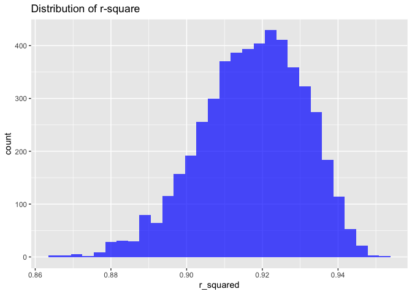
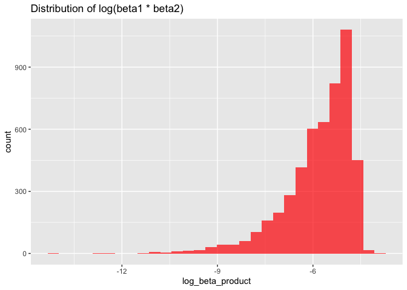

p8105_hw6
================
Tara Zhan_fz2377
2023-11-28

# Problem 1

# Problem 2

``` r
# Loading dataset: "weather_df"
weather_df = 
  rnoaa::meteo_pull_monitors(
    c("USW00094728"),
    var = c("prcp", "tmin", "tmax"), 
    date_min = "2022-01-01",
    date_max = "2022-12-31") |>
  mutate(
    name = recode(id, USW00094728 = "CentralPark_NY"),
    tmin = tmin / 10,
    tmax = tmax / 10) |>
  select(name, id, everything())
```

This weather data for Central Park, New York, for the year 2022,
focusing on precipitation (PRCP), minimum temperature (TMIN), and
maximum temperature (TMAX).

``` r
# Define a bootstrap function
bootstrap_function = function(data) {
  sample_data = sample_n(data, size = nrow(data), replace = TRUE)
  model = lm(tmax ~ tmin + prcp, data = sample_data)
  r_squared = glance(model)$r.squared
  coefs = tidy(model)
  log_beta_product = log(abs(coefs$estimate[2] * coefs$estimate[3]))
  return(c(r_squared, log_beta_product))
}
# Perform the bootstrap for 5000 samples
set.seed(123)
n_bootstrap = 5000
bootstrap_results = replicate(n_bootstrap, bootstrap_function(weather_df))
bootstrap_df = as.data.frame(t(bootstrap_results))
colnames(bootstrap_df) = c("r_squared", "log_beta_product")

# Plotting
ggplot(bootstrap_df, aes(x = r_squared)) +
  geom_histogram(bins = 30, fill = "blue", alpha = 0.7) +
  labs(title = "Distribution of r-square")
```

<!-- -->

``` r
ggplot(bootstrap_df, aes(x = log_beta_product)) +
  geom_histogram(bins = 30, fill = "red", alpha = 0.7) +
  labs(title = "Distribution of log(beta1 * beta2)")
```

<!-- -->

``` r
# Calculating Confidence Intervals
r_sq_ci = quantile(bootstrap_df$r_squared, probs = c(0.025, 0.975))
print(r_sq_ci)
```

    ##      2.5%     97.5% 
    ## 0.8882079 0.9402552

``` r
log_beta_ci = quantile(bootstrap_df$log_beta_product, probs = c(0.025, 0.975))
print(log_beta_ci)
```

    ##      2.5%     97.5% 
    ## -8.696970 -4.601153

The histogram of Distribution of r-square is slightly skewed to left
side, with the 2.5% quantile at 0.8882079 and 97.5% quantile at
0.9402552 in the distribution. The histogram of Distribution of
log(beta1 \* beta2) is skewed to left side obviously, with the 2.5%
quantile at -8.696970 and 97.5% quantile at -4.601153 in the
distribution.

# Problem 3
